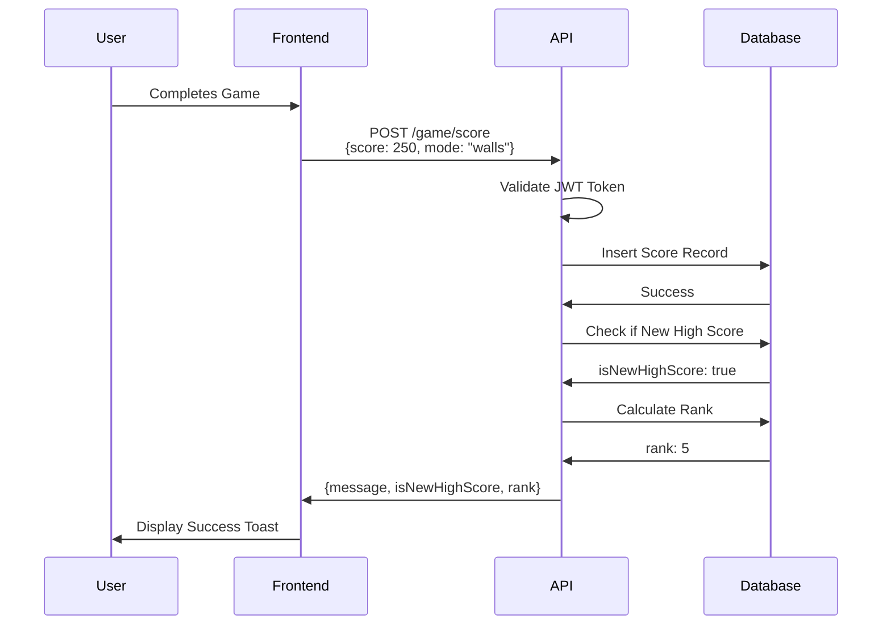
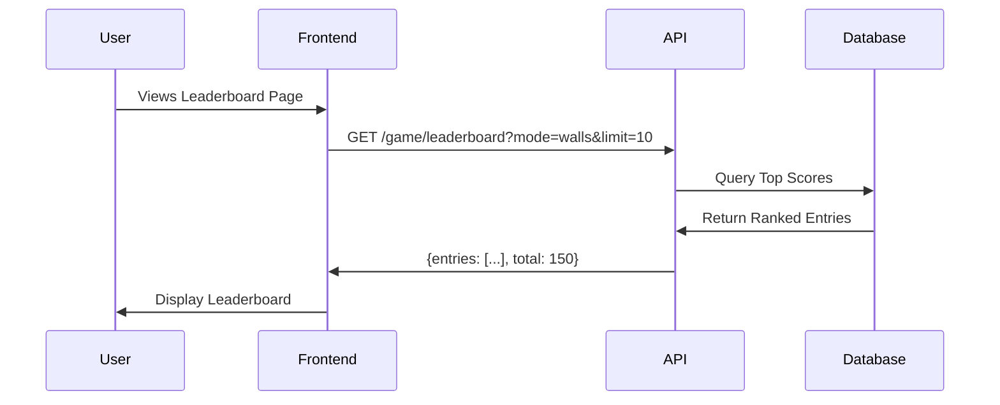
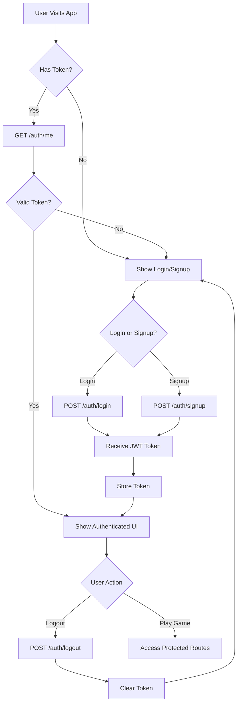
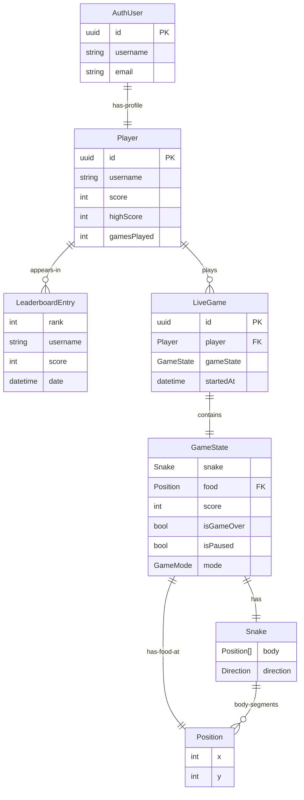
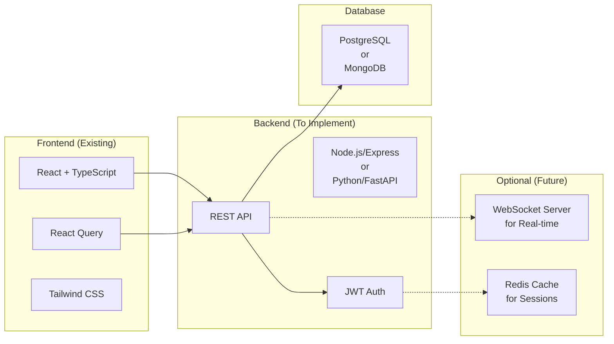

# API Architecture Overview

This document provides a visual overview of the Snake Showdown API architecture.

## API Endpoint Structure

```mermaid
graph TB
    subgraph "Client (React Frontend)"
        A[Snake Showdown App]
    end
    
    subgraph "API Server"
        B[/auth/signup<br/>POST]
        C[/auth/login<br/>POST]
        D[/auth/logout<br/>POST]
        E[/auth/me<br/>GET]
        F[/game/score<br/>POST]
        G[/game/leaderboard<br/>GET]
        H[/game/live<br/>GET]
        I[/player/profile<br/>GET]
    end
    
    subgraph "Auth Required"
        D
        E
        F
        I
    end
    
    subgraph "Public Endpoints"
        B
        C
        G
        H
    end
    
    A -->|Register| B
    A -->|Login| C
    A -->|Logout| D
    A -->|Get Current User| E
    A -->|Submit Score| F
    A -->|View Leaderboard| G
    A -->|Watch Live Games| H
    A -->|View Profile| I
    
    B -->|Returns JWT Token| A
    C -->|Returns JWT Token| A
    
    style D fill:#ff6b6b
    style E fill:#ff6b6b
    style F fill:#ff6b6b
    style I fill:#ff6b6b
    style B fill:#4ecdc4
    style C fill:#4ecdc4
    style G fill:#4ecdc4
    style H fill:#4ecdc4
```

## Data Flow: Score Submission



## Data Flow: Leaderboard Query



## Authentication Flow



## Data Models Relationships



## Tech Stack Recommendation


